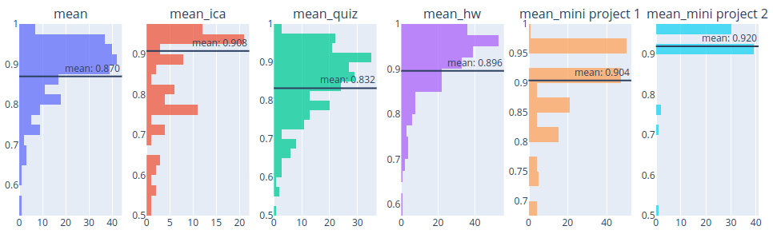

# Gradescope Mean

A utility which computes final grades (example: [grade_full.csv](doc/grade_full.csv)) from gradescope outputs.  It allows the user to ...
- weight assignments per category
  - e.g. all HW assignments are 50% of grade
- waive lowest N assignments per category
  - e.g. 2 lowest HW assignments, per student, are waived
- apply a late penalty (per day) that assignments are submitted beyond 
  deadline
  - e.g. HW is penalized 15% of average weighted assignment in category
  - also includes support for not penalizing the first N "late days" per assignment category (e.g. each student may use up to 3 "late days" across all HWs without penalty)
- waive assignments per individual student
- validate gradescope student list by passing an email list of active students
  - e.g. one student has a low average grade, have they dropped the course?
- exclude assignments which shouldn't be included in final grade
  - assignments automatically excluded if they don't have some minimum completion threshold
- substitute one assignment in place of another (where substitute has 
  higher percentage)
  - e.g. to "merge" two versions of the quiz with their own unique gradescope assignment
    1. substitute `quiz_02` for `quiz_01`
    2. exclude `quiz_02`

You can also view histograms ([hist.html](doc/hist.html)) per assignment category to get a quick sense of where your students are:

You can upload to [Northeastern's Banner](doc/upload_banner.md) or [Canvas](doc/upload_canvas.md) from the given `grade_full.csv`

# Installation 

    pip3 install gradescope-mean

# Usage

Download all gradescope assignments to some local `scope.csv` file 
(`Assignments > Download Grades > Download CSV`) and run:

    python -m gradescope_mean scope.csv

to create outputs ([grade_full.csv](doc/grade_full.csv) and [hist.html](doc/hist.html)) using default options.
This first run will have created a `config.yaml` configuration file which you can modify to take advantage of the functionality listed above (details given in the [configuration doc](doc/config.md)).
To re-run with your configuration options:

    python -m gradescope_mean scope.csv --config config.yaml