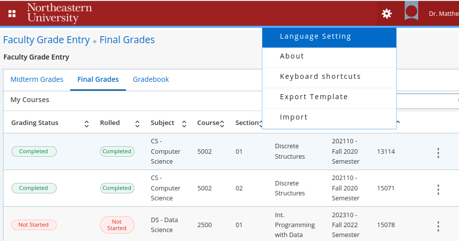

# Preparing xlsx to upload to banner

Banner will accept an `xlsx` file and allow you to associate columns from your input to the necessary banner fields.  If all three of the following banner fields match a student in the selected course then the remaining fields (e.g. any column you choose as a "Final Grade") is uploaded for that student:
- CRN (5 digits)
- Term Code (6 digits)
  - e.g. "202310" for the third row of the image above
- Student ID (9 digits)
  - should not include the "S" suffix often on NUIDs

You can supply the proper CRN and Term Codes to generate an xlsx file from the `grade_full.csv` output as:

    python3 -m gradescope_mean.banner grade_full.csv term-code-here -c crn-first-here -c crn-second-here

# Uploading to Banner

By first selecting a course (click on a row) and then clicking the "gear" in the top right you can "import" grades to Banner for that course:

If a record in the uploaded `xlsx` doesn't match all three fields above, a warning is thrown.

## Multiple Sections "Trick"
By uploading this same `xlsx` file and changing which CRN column you specify in Banner, Banner will discard all mismatched student-CRN with a warning while updating all consistent student-CRN entries.    